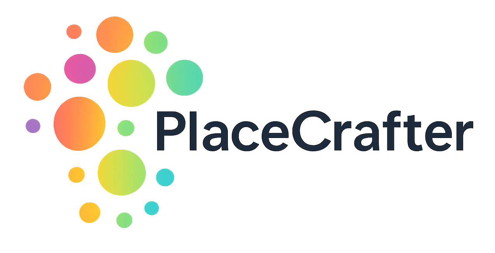

A research project mapping functional urban regions worldwide using multi-source open data and AI-driven descriptors, moving beyond administrative boundaries to capture the platial dynamics of city life.

## Overview

The Global Platial Atlas operationalises functional *platial regions* across 50–100 cities globally, building on the PlaceCrafter framework to produce both a scholarly atlas and dynamic interactive platform (PlatialAtlas.org).

## Problem

Urban research typically relies on census tracts or municipal boundaries, which fail to reflect lived experiences of cities. Current clustering methods are fragmented and not reproducible, with most studies relying only on POIs while ignoring physical, demographic, and affective context.

## Methodology: PlaceCrafter

1. **Filter** POIs into harmonised categories (leisure, commerce, religion, health, culture, nature)
2. **Cluster** with multiple algorithms (K-Means, DBSCAN, hierarchical)
3. **Validate** with Silhouette scores, Moran's I, Nearest Neighbour Index
4. **Enrich** with contextual layers from six open datasets:
   - OSM POIs → functional anchors
   - Land Cover → physical context
   - Overture Maps → buildings & transport
   - Social Media → vibrancy & sentiment
   - Nighttime Lights → economic activity
   - Population → density normalisation
5. **Describe** using LLMs to generate human-readable platial descriptors
6. **Visualise** through convex hulls, fuzzy spray-can maps, and influence grids

## Outputs

- **Book**: *The Platial Atlas* covering global cities, medium towns, and smaller areas
- **Website**: *PlatialAtlas.org* with interactive maps, open datasets, and reproducible workflows

## Impact

Establishes a reproducible, multi-source, global dataset of platial regions for urban research, policy (SDG 11, WHO Healthy Cities), and public understanding of how cities function as lived spaces.

---

*Building on platial GIS methods to create the first global comparative dataset of functional urban places.*
